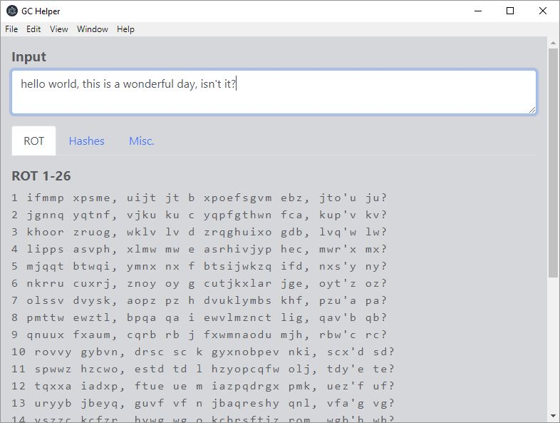

# GcHelper

Simple [Electron](http://electron.atom.io) application that helps to
solve GV puzzles by offering decoding help for some algorithms.

## Getting started

- Install [Node LTS](https://nodejs.org)
- Clone this repository
- `cd gchelper`
- `npm install` to install the application's dependencies
- `npm start` to start the application

## Functionality

### ROT encoding
Show all 26 ROT encodings of an input text. 

### Hashes
Display several hashes for an input text.
