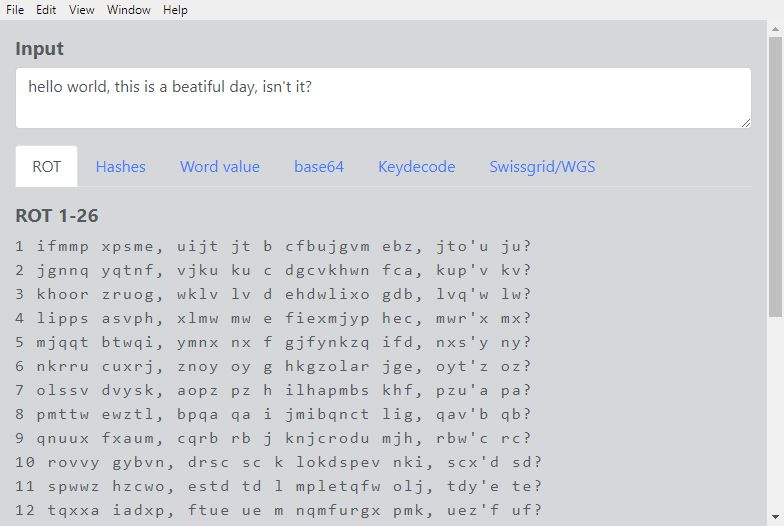
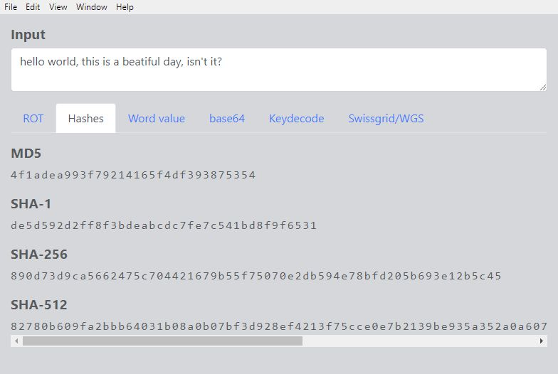
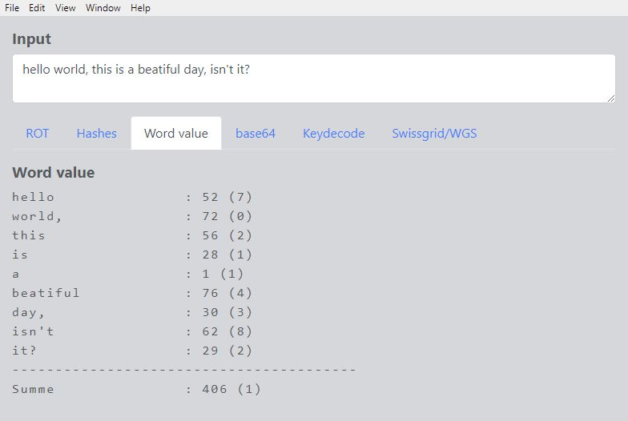
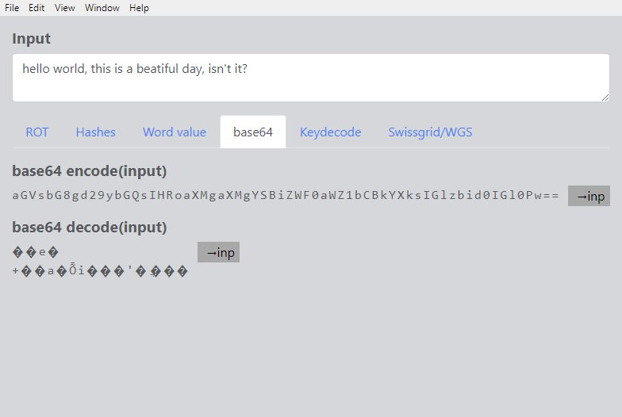
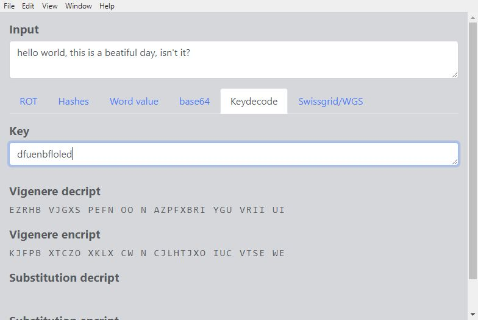
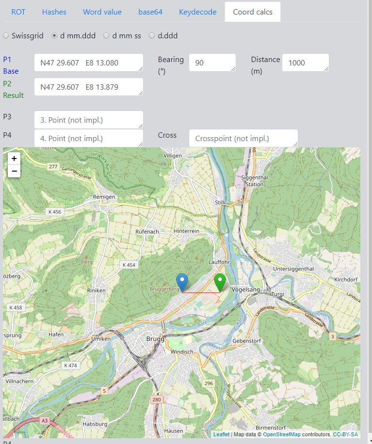

# GcHelper

Simple [Electron](https://electron.atom.io) application that helps to
solve [geocaching](https://www.geocaching.com) puzzles by offering encoding/decoding help for some typical used methods as well as assistance for simple coordinate calculations. 

Positions are shown on a map.

The application has been developed for own usage. Error handling is moderate...  
Comments are welcome.

## Getting started

- Install [Node LTS](https://nodejs.org)
- Clone this repository
- `cd gchelper`
- `npm install` to install the application's dependencies
- `npm start` to start the application

## Functionality

### ROT encoding
Show all 26 ROT encodings of an input text. 

### Hashes
Display several hashes for an input text.

### Word values
Calculate the word values of an input text.

### base64 encoding and decoding
base64 encoding and (possible) decoding of an input text.

### Ciphers using a key
Encoding and decoding of some ciphers with a key.

### Simple coordinate calculations and conversions
- Calculations:
  - Projection
  - Distance and bearing between 2 points
  - (not implemented yet) Crosspoint of 2 lines
- Convert between WGS84 and Swissgrid coordinates
  - WGS84 decimal
  - WGS84 degrees, minutes, seconds
  - WGS84 degrees, decimal minutes (standard geocaching format)
  - Swissgrid 1901

